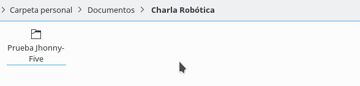
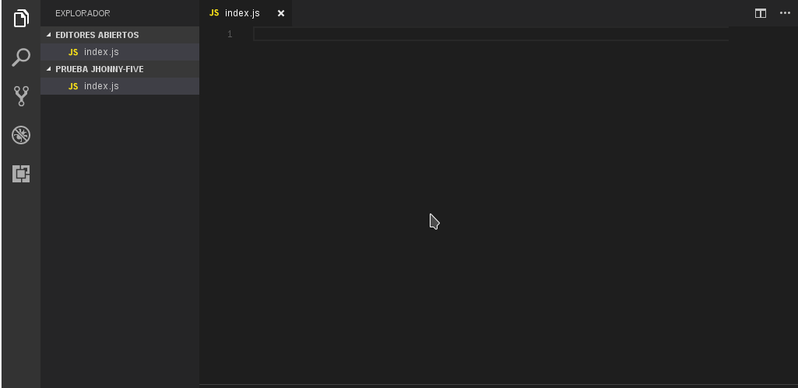
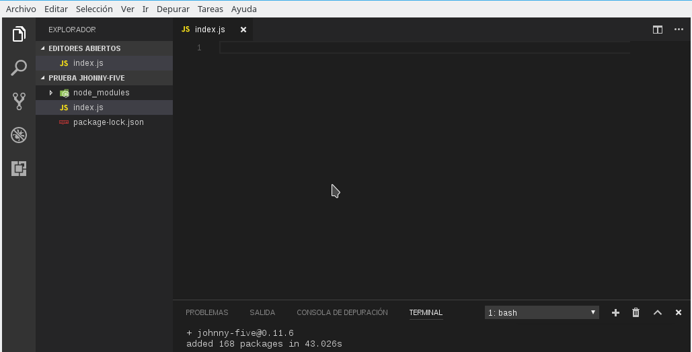

<!-- TOC -->

- [Johnny-Five: Otra forma de ver lo mismo.](#johnny-five-otra-forma-de-ver-lo-mismo)
    - [Arduino con algo más.](#arduino-con-algo-más)
    - [Node.js + Arduino = Jhonny-Five](#nodejs--arduino--jhonny-five)
    - [Hello World en Jhonny-Five](#hello-world-en-jhonny-five)
    - [Ventajas y Desventajas](#ventajas-y-desventajas)

<!-- /TOC -->
# Johnny-Five: Otra forma de ver lo mismo.
Seguramente cuando quisiste empezar a ver algo de programación y/o de automatismo, te topaste con una de las plataformas Open Source más grande del mundo: **Arduino**. Para aquellos que no conozcan, [Arduino](https://www.arduino.cc/) es una plataforma electrónica de código abierto (cumple con las 4 leyes) que se basa en dos pilares fundamentales: *hardware y software fáciles de usar*. Razones por las cuales es tán explotada.

Pongamos lo mismo en otros términos. Si quisieras programar algo en otra plataforma (que no sea Arduino), necesitarias una serie de componentes (el microcontrolador, quemadores de microcontroladores, relojes de cuarzo, protoboards en el caso de que no quieras grabar una placa PCB, etc) que, para un principiante, **puede que cargue un grado importante de complejidad**, que distraiga y (en los peores casos) haga perder interés, denotando esa idea como muy difícil. En cambio, si queremos prototipar algo rápido (ya sea para aprender o para ver cómo funciona y luego mejorarlo), en el caso de Arduino vamos a necesitar solamente comprar una [placa Arduino](https://www.arduino.cc/en/Main/Products) y poner nuestra mejor voluntad. Tan fácil como eso.

## Arduino con algo más.
Después de estar un largo tiempo probando distintos tipos de sensores o de modos de trabajo, seguramente vas a querer utilizar los datos obtenidos en la placa para algo más. Y en la gran mayoría de los casos, *ese algo más* se traduce a colocarlos en una página web.

Para colocarlo en una página web, las cosas se empiezan a "complejizar".
* Hay que programar la placa para que mande los datos una computadora (que, este caso, suponemos es el mismo servidor).
* Hay que programar la parte de backend de la página web (que para la mayoría de los casos es PHP, pero puede ser el lenguaje que más te guste).
* Hay que armar la página web que se va a encargar de mostrar los datos que son recogidos de la placa. (En este caso, vamos a utilizar HTML y CSS)

Es decir, para poder mostrar solamente los datos que voy a levantar de mi placa, voy a usar 4 lenguajes: **Arduino para la placa, PHP o el lenguaje que elija para la parte de backend y HTML y CSS para la página web**. Veamos si podemos simplificar esto.

## Node.js + Arduino = Jhonny-Five

Johnny-Five es una librería de programación para robótica basado en javascript lanzado por Bocoup en el 2012. Si bien en un principio nació exclusivamente para programación de robots, la comunidad empezó a buscarle nuevas aplicaciones por lo que, en la actualidad, muchos usuarios la utilizan para integrar de manera fácil sus arduino a aplicaciones web. La mágia detrás de todo esto es la librería **[Firmdata](https://www.arduino.cc/en/Reference/Firmata)**, razón por la cual primeramente vamos a tener que grabarla en la placa Arduino.

## Hello World en Jhonny-Five
Como es de suponer, partimos de la base que su máquina ya tiene instalado [Node.js](https://nodejs.org/en/) (si no es así, el link de descarga está resaltado anteriormente en azul) y una placa arduino.

Crearemos una carpeta (que llamaremos **Prueba Jhonny-Five**) tendremos todo nuestro proyecto.


Dentro, vamos a crear un archivo que vamos a llamar **index.js** y lo abriremos con nuestro editor de texto favorito (en nuestro caso, [Visual Studio Code](https://code.visualstudio.com/)).



Ahora abrimos una terminal y escribimos dentro

`
    npm install johnny-five
`

Debería quedarnos algo así:


**node_modules** es la carpeta por defecto donde se colocarán todas las librerías que descarguemos del repositorio [NPM](https://www.npmjs.com/) (como fue este caso) y por ende, donde Node.js buscará por defecto cada vez que usemos la palabra **require** (a menos que especifiquemos un directorio, como puede ser en otros casos).
Ahora carguemos el código para empezar a trabajar:

```javascript
var five = require("johnny-five");
var board = new five.Board();

board.on("ready", function() {
  var led = new five.Led(13);
  led.blink(500);
});
```

"Vamos por parte", diría Jack The Ripper. En la primeras dos líneas nos encontramos con

```javascript
    var five = require("johnny-five");
    var board = new five.Board();
```

En la primera, lo que hacemos es importar la librería Jhonny-Five a nuestro proyecto. **Es crucial para poder seguir con el resto**.

En la segunda línea **creamos una placa** en nuestro proyecto (que, básicamente, será la que conectemos). Si vamos a conectar solamente una, no colocamos ninguna opción (ya que por defecto asumirá que esa la placa). En el caso de que usemos más de una (o de tener mas de un puerto COM en uso), es necesario colocar el puerto donde está colocada. Un ejemplo.

```javascript
    var board = new five.Board({ port: "COM*" });
```
Donde **"COM\*"** es el puerto donde está conectada la placa.

Si seguimos leyendo, **nos encontramos con el corazón de la librería: la programación en si misma de la placa**.

```javascript
board.on("ready", function() {
  var led = new five.Led(13);
  led.blink(500);
});
```
Como es sabido, **JavaScript es un lenguaje orientado a eventos**, por lo que con la función **board.on** esperamos a que se accione el evento **ready**, es decir, que la placa esté en condiciones para empezar a trabajar. Es posible tener acceso a otros eventos tal como podemos encontrar en [la documentación](http://johnny-five.io/api/board/#events), pero por cuestiones de simplicidad no las veremos en esta documentación.

Si la placa está preparada, ejecuta un [callback](https://fernetjs.com/2011/12/creando-y-utilizando-callbacks/) donde se crea una variable llamada **led**, en el pin 13 (podría ser cualquier otro). Luego, le asigna un **blink** (prendido y apagado) con un tiempo entre uno y otro de medio segundo (un segundo se compone de 1000 ms).

Por último, ejecutamos en nuestra terminal

`node index.js`

Y si todo salió bien, vamos a ver cómo prende y apaga el led en nuestra placa.

## Ventajas y Desventajas
Si bien puede parecer algo complicado en un inicio, en aplicaciones más grandes esto puede resultar una gran ventaja. No se mencionó, pero si tengo una placa conectada de manera inalámbrica (sea WiFi o Bluetooth), **puedo modificar el programa (agregar, actualizar o quitar funciones) sin necesidad de quitar la placa de su lugar de trabajo**, es decir, remotamente. También, **puedo configurar varias placas**, por lo que realizar una actualización sólo una vez y ver su resultado replicado por la cantidad de placas que lo sufran.

**La gran desventaja que sufre es que los datos son enviados siempre**. Es decir, cuando nosotros armamos el código, éste es enviado a cada placa cada vez que es necesario ejecutar alguna instrucción, por lo que **la placa es esclava del sistema que contiene su programa**. Si surge un problema de comunicación entre las partes la segunda (la placa) quedaría congelada, esperando instrucciones nuevamente. En aplicaciones donde se requiera que el sistema sea tolerante a fallos o la comunicación sea inestable, puede que esto sea un gran impedimento y algo clave a tener en cuenta.